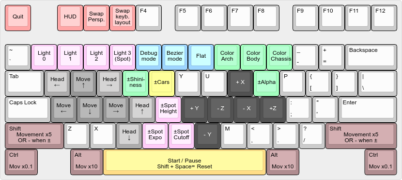

## Keyboard Layout

Omdat ik de camera besturen met `XYZ` in absolute coordinaten onbruikbaar vind, heb ik een basis "FPS" camera geimplementeed met de classieke `ZQSD` toetsen. (Of `WASD` als u ondanks de Belgishe normen een `QWERTY` model gebruikt.) Verder is besturing van de camera via muis (inclusief het "scrolwiel") mogelijk.

### Features

Waar van toepassing zijn de standaardwaarden in het vet gedrukt.

+ `ESC`: Sluit het programma
+ `F1`: Toggle HUD
+ `F2`: Cycle tussen `Ortho`, `Frustum` en **`FOV`**.
+ `F3`: Cycle tussen `Absolute`, `QWERTY` en **`AZERTY`**.
+ `1`, `2`, `3`, `4`: Toggle respectievelijk light 1 t.e.m. 4. Light 4 is de spot.
+ `5`: Toggle debug mode
  + Tekent assen op `(0;0;0)`.
  + Wireframe ipv volle figuren.
  + Controlepunten van de Bézier-oppervlak.
  + Als de cameramodus absolute is, wordt het "target" ook aangeduid met een klein assenstelsel.
  + Teken een klein assenstelsel waar de lightpunten zijn.
+ `6`: Toggle Bézier mode (**`FULL`** of `LINES`).
+ `7`: Toggle shading model (**`SMOOTH`** of `FLAT`).
+ `8`, `9`, `0`: Verander de kleur van respectievelijk de boog, de carrosserie of het onderstel.
+ `SPATIE`: Start of pauseer de race.
+ `SHIFT + SPATIE`: Reset de race.
+ `r`, `R`: + of - Shininess
+ `t`, `T`: + of - Autos/zeepkisten.
+ `o`, `O`: + of - Transparantie.
+ `g`, `G`: + of - Spot hoogte.
+ `v`, `V`: + of - Spot exponent.
+ `b`, `B`: + of - Spot cutoff.

### Beweging

Beweging kan met de muis (behalve in absolute modus). Links ingedrukt bewegen is bewegen in de $\Updownarrow$ en $\Leftrightarrow$ richtingen. Met rechts ingedruk houden kan de rotatie van de camera worden veranderd. Het scrollwieltje beweegt vooruit of achteruit volgens de richting van de camera. Met de middenknop kan absoluut in het XZ vlak worden bewogen.

Verder kan `SHIFT` gebruikt worden om de beweging van de toesen met factor $5$ versnellen. `CTRL` is een factor $0,1$, `ALT` is een factor $10$. Deze kunnen gecombineerd worden.

In de normale camera modus zijn de toetsen als volgd: (`QWERTY` modus tussen haakjes)

+ `ZQSD` (`WASD`): beweging volgens camera.
+ `AEFC` (`QEFC`): camera roteren.
+ `HNIJKL` (`HNIJKL`): absolute beweging volgens `XYZ`.

Er is ook een absolute modus, waarbij de camera en target kunnen worden bewogen met:
`SHIFT` is hier een factor $-1$.

+ `xyz`: camera bewegen
+ `jkl`: target bewegen

## Code

Ik heb alle uitbreidingen gemaak met uitzondering van de boog en de mist.

Sommige delen van de code zijn niet (volledig) zelf gescheven. Waar dit het geval is, staat dit duidelijk aangegeven in de header van de functie, met verwijzing naar de bron.

Ik heb overal logische functienamen gebruikt en voldoende commentaar voorzien (volgens mijn eigen oordeel). Het volledig opsommen van alle functies hier zou enorm veel plaats innemen, dus heb ik geopteerd voor een concondenseerde aanpak.
Een lijst van de belangrijkste functies per bestand: 

+ `main.c`
  + Bevat definities alle (niet static) globale variabelen.
  + main
  + OpenGL callbacks (idle, reshape, en display)
+ `globals.h`
  + Includes
  + Eigen types
  + Declaraties (niet static) globale variabelen
  + Declaraties (niet static) functies uit main
+ `draw.c/h`
  + Teken functies voor objecten en nodige helpers
  + Alle fucnties hebben prefix `draw_`
+ `input.c/h`
  + OpenGL callbacks om user input te verwerken
  + Enkele globale variabelen nodig voor muis functies
+ `text.c/h`
  + Functies die toelaten om strings te teken op het scherm als HUD.
+ `stl.c/h`
  + Functies dit toelaten STL model files te laden en weer te geven.
+ `textures.c/h`
  + Functies om BMP afbeeldingen te kunnen gebruiken als textures in OpenGL.
  + Deze code is grotendeels afkomstig van het internet, zoals aangegeven in de header.
